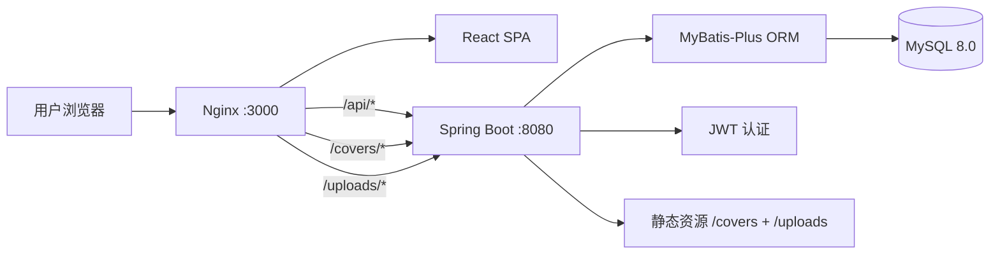
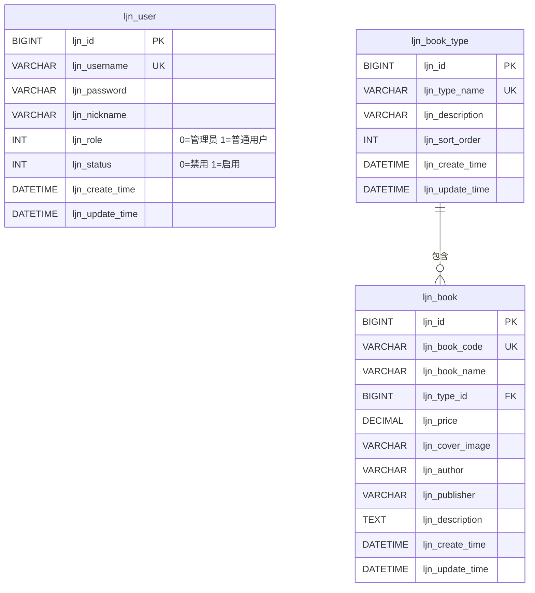

# 🌸 LJN 图书信息管理系统

> **知识的花园，为你绽放** — 一站式图书信息管理解决方案，支持多角色权限控制、图书分类管理与智能检索。

---

## 🛠 技术栈

- **Frontend**: React 18 + Vite + TailwindCSS + React Router 6
- **Backend**: Java Spring Boot 2.7 + MyBatis-Plus + Spring Security + JWT
- **Database**: MySQL 8.0
- **Infrastructure**: Docker + Nginx

---

## 🏗️ 系统架构



### 核心模块职责

| 模块 | 职责 |
|------|------|
| `LjnAuthController` | 用户认证（登录/注册） |
| `LjnBookController` | 图书 CRUD + 多条件高级检索 |
| `LjnBookTypeController` | 图书类型 CRUD |
| `LjnUserController` | 用户管理 + 个人中心 + 密码修改 |
| `LjnUploadController` | 图书封面图片上传 |
| `LjnJwtAuthFilter` | JWT Token 鉴权过滤器 |
| `LjnGlobalExceptionHandler` | 全局异常统一处理 |

---

## 💾 数据库设计



---

## 🚀 快速启动 (Docker)

1. 确保 Docker Desktop 已运行。
2. 在本项目上一级目录执行：
   ```bash
   docker build -t ljn-library-3407 .
   docker run --rm -p 3000:80 -p 8000:8080 ljn-library-3407
   ```
3. 看到 `LJN Library started successfully` 后即可访问系统。

## 🔗 服务地址

| 服务 | 地址 |
|------|------|
| **前端** | http://localhost:3000 |
| **后端 API** | http://localhost:8000 |
| **数据库** | 容器内 MySQL，应用自动初始化 |

---

## 🧪 测试账号

| 角色 | 用户名 | 密码 | 权限说明 |
|------|--------|------|----------|
| 管理员 | `admin` | `123456` | 图书管理、类型管理、用户管理、图书浏览 |
| 普通用户 | `user` | `123456` | 图书浏览、图书查询 |

---

## 📷 核心功能

### 1. 图书管理（管理员）
- 图书信息的增、删、改、查
- 图书信息包括：编号、名称、类型、价格、封面图片、作者、出版社、描述
- **单条件查询**：按图书编号、图书类型等单一条件查询
- **多条件查询**：支持图书名称 + 图书类型 + 价格范围等多条件组合查询
- 12 本预置图书含精美封面插画，5:7 竖版比例完美展示

### 2. 图书类型管理（管理员）
- 图书类型的增、删、改、查
- 删除类型前自动检测关联图书，防止误删

### 3. 用户管理（管理员）
- 用户信息的增、删、改、查
- 用户权限分为 0（管理员）和 1（普通用户）
- 管理员不能修改自己的角色和禁用自己的账号

### 4. 图书浏览（所有用户）
- 卡片式图书展示，封面按 5:7 原始比例完整展示
- 支持简单查询和高级查询
- 点击卡片查看图书详情（含封面大图、完整信息）

### 5. 个人中心
- 修改昵称（实时同步到导航栏）
- 修改密码（需验证旧密码）

### 6. 权限控制
- 普通用户：注册、登录、浏览图书、查询图书
- 管理员：图书管理、类型管理、用户管理 + 普通用户所有功能
- 未登录用户自动跳转登录页

---

## 📁 项目结构

```
repo/
├── README.md                   # 项目文档
├── frontend/                   # 前端项目
│   ├── nginx.conf              # Nginx 反向代理配置
│   ├── package.json            # 依赖管理
│   ├── vite.config.js          # Vite 构建配置
│   ├── tailwind.config.js      # TailwindCSS 主题配置
│   └── src/
│       ├── main.jsx            # 入口文件
│       ├── App.jsx             # 路由配置 + 权限守卫
│       ├── index.css           # 全局样式 + 组件类
│       ├── utils/
│       │   ├── ljnRequest.js   # Axios 封装 + 拦截器
│       │   └── ljnAuth.js      # 认证工具函数
│       ├── components/
│       │   ├── LjnModal.jsx    # 模态框组件
│       │   ├── LjnConfirm.jsx  # 确认对话框组件
│       │   └── LjnPagination.jsx # 分页组件
│       └── pages/
│           ├── LjnLogin.jsx    # 登录/注册页
│           ├── LjnLayout.jsx   # 后台布局
│           ├── LjnBookManage.jsx     # 图书管理
│           ├── LjnBookTypeManage.jsx # 类型管理
│           ├── LjnUserManage.jsx     # 用户管理
│           ├── LjnBrowse.jsx         # 图书浏览
│           └── LjnProfile.jsx       # 个人中心
└── backend/                    # 后端项目
    ├── settings.xml            # Maven 阿里云镜像
    ├── pom.xml                 # Maven 依赖管理
    └── src/main/
        ├── resources/
        │   ├── application.yml # 应用配置
        │   ├── db/init.sql     # 数据库初始化脚本
        │   └── static/covers/  # 12 张预置图书封面
        └── java/com/ljn/library/
            ├── LjnLibraryApplication.java  # 启动类
            ├── entity/         # 实体类 (LjnUser, LjnBook, LjnBookType)
            ├── dto/            # 数据传输对象
            ├── mapper/         # MyBatis-Plus Mapper
            ├── service/        # 业务逻辑层
            ├── controller/     # REST 控制器
            ├── config/         # 配置类
            ├── security/       # JWT 安全组件
            ├── common/         # 统一响应封装
            └── exception/      # 全局异常处理
```

---

## 🔧 专业工程实践

### 1. 日志系统
- 使用 SLF4J + Logback 标准日志框架
- 按模块分级日志输出（DEBUG/INFO/WARN/ERROR）
- 关键操作（登录、CRUD）均有日志记录

### 2. 错误处理
- `LjnGlobalExceptionHandler` 全局异常统一拦截
- 前端 Axios 拦截器统一处理，支持 2 秒消息去重
- 业务异常友好提示（如"该类型下有 N 本图书，无法删除"）
- 401 自动跳转登录页，403 权限不足提示

### 3. 数据校验
- 后端：`@NotBlank`, `@Size` 等 JSR-303 校验注解
- 前端：表单提交前完整校验（用户名长度、密码长度等）
- 关联数据删除前检查（外键约束友好提示）

### 4. 接口设计
- RESTful 风格 API，统一响应格式 `{code, message, data}`
- 基于角色的权限控制 `@PreAuthorize("hasRole('ADMIN')")`
- 分页查询统一封装 `LjnPageResult`

### 5. 生产级特性清单

| 维度 | 状态 | 说明 |
|------|------|------|
| 响应式布局 | ✅ | PC + 移动端自适应 |
| 数据持久化 | ✅ | 容器内 MySQL 数据目录 |
| 模块化架构 | ✅ | 前后端分离，职责清晰 |
| 安全认证 | ✅ | JWT + BCrypt + Spring Security |
| 国际化编码 | ✅ | 全链路 UTF-8，中文不乱码 |
| 文件上传 | ✅ | 图书封面上传 + 持久化存储 |
| 预置封面 | ✅ | 12 本种子图书含精美封面插画 |
| 数据初始化 | ✅ | 自动 Seed 演示数据，非空库交付 |
| 容器化部署 | ✅ | 单 Dockerfile 构建启动 |

---

## 🐳 Docker 镜像源配置

### 镜像列表

| 服务 | 镜像 | 说明 |
|------|------|------|
| MySQL | 容器内服务 | 数据库 |
| Java | `eclipse-temurin:17-jdk-jammy` | Spring Boot 构建和运行 |
| Node.js | `nodejs 20` | 前端构建 |
| Nginx | Ubuntu Nginx | 前端生产环境和反向代理 |

### 加速配置

- **npm**: 使用淘宝镜像 `registry.npmmirror.com`
- **Maven**: 使用阿里云镜像 `maven.aliyun.com`

### 常见问题

**Q: Docker 端口冲突？**
A: 调整 `docker run` 里的宿主机端口，例如 `-p 3001:80 -p 8001:8080`。

**Q: 首次启动后端连接数据库失败？**
A: 启动命令会先等待 MySQL 就绪，再初始化数据并启动后端。

**Q: admin 账号无法登录？**
A: 应用启动时 `LjnDataInitializer` 会自动修复管理员密码。
